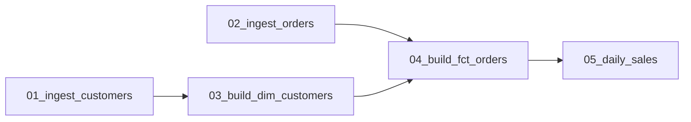

# fabric-notebook-dependency-mapper

Working on Microsoft Fabric / Spark data platforms, I kept running into the same problem: dozens of
notebooks build tables across bronze / silver / gold, and they have to run in the right order.
Maintaining that order by hand doesn't scale and breaks silently. I built a version of this at work
to derive the run order automatically from the notebooks themselves — this is a clean, generic
open-source implementation of that idea.

It reads a folder of notebooks, works out which tables each one reads and writes, and builds the
dependency graph: notebook **B depends on A** when B reads a table that A produces. From there it can
emit an execution **DAG** (parallel levels), a **Mermaid** diagram, or a flat **config table** you
can feed to an orchestrator — Fabric `runMultiple`, an ADF pipeline, Airflow, etc.

## How it works

1. Parse each notebook (`.py` Fabric/Databricks source or `.ipynb`) into code.
2. Extract `schema.table` references, restricted to a configured set of data schemas — so ordinary
   code like `spark.read` or `df.write` is ignored. Writes are detected from `CREATE TABLE`,
   `INSERT INTO` and `saveAsTable(...)`.
3. Map each table to its producing notebook; a notebook's dependencies are the producers of the
   tables it reads (minus the tables it writes itself).
4. Topologically sort the notebooks into levels.

## Install & run

```bash
python -m venv .venv && source .venv/bin/activate   # Windows: .venv\Scripts\activate
pip install -r requirements.txt

python -m depmapper examples/notebooks -f levels
```

### Execution order — levels can run in parallel (`-f levels`)

```
Level 0: 01_ingest_customers, 02_ingest_orders
Level 1: 03_build_dim_customers
Level 2: 04_build_fct_orders
Level 3: 05_daily_sales
```

### Dependency graph (`-f mermaid`)



### Orchestration config (`-f csv`, also `-f json`)

```
notebook,reads,writes,dependencies
01_ingest_customers,,bronze.customers,
02_ingest_orders,,bronze.orders,
03_build_dim_customers,bronze.customers,silver.dim_customers,01_ingest_customers
04_build_fct_orders,"bronze.orders,silver.dim_customers",silver.fct_orders,"02_ingest_orders,03_build_dim_customers"
05_daily_sales,silver.fct_orders,gold.daily_sales,04_build_fct_orders
```

That last table is the useful one for automation: hand it to `runMultiple` (or any orchestrator) and
the run order maintains itself — add a notebook, and its place in the DAG is inferred.

## Configuration

By default the tool tracks the schemas `bronze, silver, staging, gold, raw, mart`. Override them with
a YAML file (`-c config.yaml`); see [`config.example.yaml`](config.example.yaml).

## Notes & limitations

- Detection is **static** (regex over code and SQL strings), not runtime. Table names built
  dynamically from variables won't be resolved.
- **Circular dependencies** are detected and reported — they usually signal a modeling mistake.
- Works on Fabric/Databricks `.py` notebook source and `.ipynb`.

Run the tests with `pytest`.
